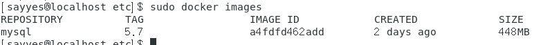
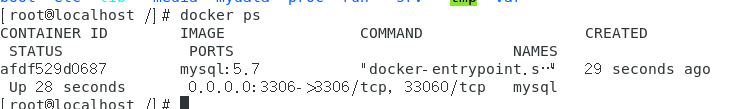
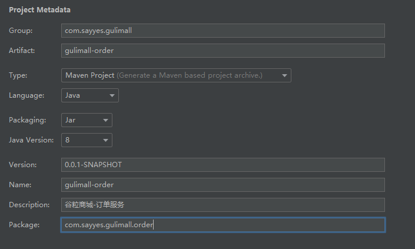

# SpringBoot案例高级

## 一、环境准备

### 1、安装Linux虚拟机

> CentOS或ubuntu
>
> 可以使用echo $LANG看服务器语言，uname查看系统命

### 2、安装docker

> 1、容器技术，可以快速搭建mysql、redis等应用。
>
> 2、仓库地址：https://hub.docker.com/
>
> 3、官方文档：https://docs.docker.com/

1）根据https://docs.docker.com/engine/install/centos/文档在centos虚拟机上面执行安装

2）安装是否成功可以docker -v查看版本

3）设置随虚拟机启动，不需要每次sudo systemctl start docker

​		设置为：sudo systemctl enable docker

4）配置镜像加速功能，推荐阿里云

https://cr.console.aliyun.com/cn-hangzhou/instances/mirrors

```shell
sudo mkdir -p /etc/docker
sudo tee /etc/docker/daemon.json <<-'EOF'
{
  "registry-mirrors": ["https://4qj7hnfl.mirror.aliyuncs.com"]
}
EOF
sudo systemctl daemon-reload
sudo systemctl restart docker
```

### 3、安装mysql

#### 1）在docker仓库中搜索下载

#### 2）**docker pull mysql:版本号，如果不跟:版本号是下载最新的**

#### 3）**使用sudo docker images查看镜像是否下载成功**



#### 4）创建实例并启动

```shell
docker run -p 3306:3306 --name mysql \
-v /mydata/mysql/log:/var/log/mysql \
-v /mydata/mysql/data:/var/lib/mysql \
-v /mydata/mysql/conf:/etc/mysql \
-e MYSQL_ROOT_PASSWORD=root \
-d mysql:5.7
#参数说明：
	-p 3306：3306，将容器的3306端口映射到主机的3306端口
	--name mysql 命名
	-v 将配置文件、日志文件、数据文件挂载到主机，相当于linux外部快捷访问方式。
	-e 初始化root用户的密码
	-d 使用哪个镜像版本
```

#### 5）查看进程docker ps



#### 6）查看连接是否成功

mysql -h 主机地址 -u 用户名 -p 用户密码

#### 7）进入容器mysql内部

docker exec -it mysql /bin/bash

#### 8）配置mysql文件

```shell
vi /mydate/mysql/confi/my.cnf
添加内容如下：

[client]
default-character-set=utf8

[mysql]
default-character-set=utf8

[mysqld]
init_connect='SET collation_connection = utf8_unicode_ci'
init_connect='SET NAMES utf8'
character-set-server=utf8
collation-server=utf8_unicode_ci
skip-character-set-client-handshake
skip-name-resolve
```

#### 9）docker重启mysql 

docker restart mysql

### 4、安装redis

#### 1）docker pull redis下载

#### 2）创建实例并启动

```shell
#先创建文件，不然会当作目录来处理
mkdir -p /mydata/redis/conf
touch /mydata/redis/conf/redis.conf

docker run -p 6379:6379 --name redis \
-v /mydata/redis/conf/redis.conf:/etc/redis/redis.conf \
-d redis redis-server /etc/redis/redis.conf

#补充说明：
-d redis-server /etc/redis/redis.conf以这个配置文件加载启动
```

#### 3）查看进程docker ps

#### 4）测试是否可以正常使用

```shell
[root@localhost conf]# docker exec -it redis redis-cli
127.0.0.1:6379> set a b
OK
127.0.0.1:6379> get a
"b"
```

#### 5）docker重启redis

docker restart redis

#### 6）redis.conf文件持久化配置（重启不会丢失缓存）

appendonly yes

#### 7）redisk可视化工具（可选）

redisdesktopmanager工具

### 5、开发环境

- jdk1.8

- maven（本地文件配置、idea配置）

- idea（java开发）
  - 插件安装Lombok（简化代码开发）
  - 插件安装MybatisX（快速从mapper定位xml文件）

- VSCode（前端开发）
  - 插件Auto Close Tag
  - 插件Auto Rename Tag
  - Chinese Language Pack for VS
  - Eslint
  - html css support
  - html suippets
  - javascript(es6)
  - live server
  - open in browser
  - vetur
- git 版本管理

## 二、项目开发

### 1、idea创建工程各个模块（Spring Initializr向导）

商品服务、仓储服务、订单服务、优惠券服务、用户服务

共同：

​		spring的共同部分web、openfeign

​		每个服务，包名类似，除了根据服务不同区分



2、

